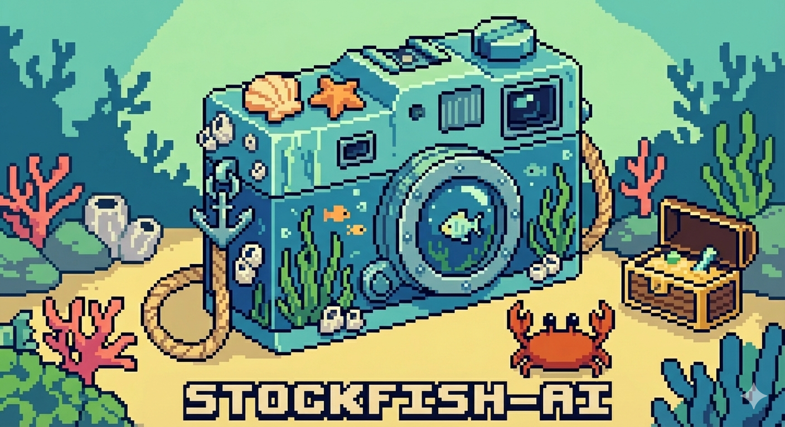

# Tutorial Walkthrough for Stockfish-AI

created and maintained by Emmanuel Rassou

Visit the website at [https://humic.ai/tutorial](https://humic.ai/tutorial)

## A: General Setup

You'll learn how to set up your development environment, including creating a Python virtual environment, installing dependencies, and using Git for version control.

## B: Creating vector embeddings from Images

You'll learn how to use the CLIP model to convert images into high-dimensional vector embeddings that capture visual features for similarity search.

## C: VectorDB Setup with Pinecone

You'll learn how to configure and set up Pinecone as a vector database, create indexes, and seed your database with fish image embeddings and metadata.

## D: VectorDB Querying

You'll learn how to perform similarity searches on your vector database to find the most similar fish species based on image embeddings and understand different similarity metrics.

## E: UI with Gradio

You'll learn how to build an interactive web interface using Gradio to upload images and display fish recognition results with formatted metadata and visual components.

## F: BONUS context-aware chatbot

You'll learn how to build a context-aware chatbot that can answer questions about fish species using the vector database embeddings and metadata to provide intelligent, image-based responses.